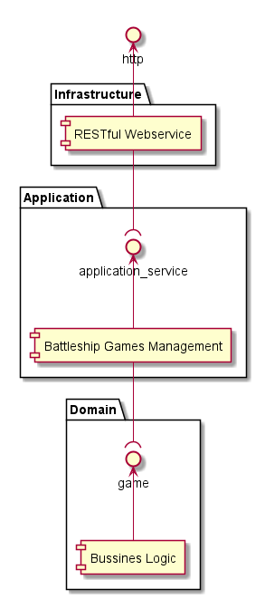

# Schiffeversenken: Ein Beispiel für BDD

## Kommunikationsprobleme bei der Softwareentwicklung

Häufig ist schlechte Kommunikation zwischen den Projektbeteiligten der Grund für mangelhafte Software.

- Entwickler verstehen die Domäne nicht ausreichend
- Domänenexperten verstehen die technische Seite nicht
- Missverständnisse werden viel zu spät aufgelöst

## Lösungsmöglichkeiten

### Ubiquituous Language

Der Begriff Ubiquituous Language stammt aus dem Domain Driven Design und wird ins Deutsche mit universelle Sprache übersetzt. Sie stellt eine gemeinsame Sprache dar, die sowohl von den Domänenexperten als auch von den Entwicklern gesprochen wird. Das Angleichen der Sprache von Entwicklern und Domänenexperten führt zur Reduktion von Missverständnissen.

## Test Driven Development

- TDD Cycle: Schreibe eine Spezifikation -> Erfülle den Test -> Refactor
- Verhindere zu komplexes Design. Der geschriebene Code sollte nur den Test erfüllen, nicht mehr und nicht weniger.
- Wenn die Tests implementiert sind, kann die Software beliebig umgebaut werden, ohne dass die Gefahr besteht die Funktionalität wieder kaputt zu machen.
- Refactoring bedeutet nicht die Funktionalität des Codes zu verändern, sondern nur sein Design.
- Es sollte so lange refactored werden, bis die gewünschte Funktionalität sehr einfach eingebaut werden kann.

## BDD

Definition von Matt Wynne (Mitbegründer von Cucumber):

> BDD-Teilnehmer erforschen, entdecken und definieren die Problemdomäne und entwickeln dann das gewünschte
> Verhalten von Software mit Hilfe von Gesprächen, konkreten Beispielen und automatisierten Tests.

1. Entwickler, Tester, Domänenexperten und Stakeholder müssen schon im Vorfeld anfangen intensiv miteinander kommunizieren. Die Entwickler dürfen nicht davon ausgehen, dass der Anforderungssteller eine Lösung für sie entwirft, die sie nur noch umsetzen müssen.
2. Es muss zunächst ein klares Bild entstehen, welche Ziele erreicht werden sollen und welche Lösungen man sich von der Software verspricht. Nur die Techniker verstehen, wie eine Lösung aussehen muss, die leicht umsetzbar, wartbar und schnell zu Verfügung steht aussehen muss. 
3. Die Anforderungen an die Software müssen mit Hilfe einer gemeinsamen Sprache für alle leicht verständlich definiert werden. Um dies sicherzustellen, schreiben die Teilnehmer die Anforderungen gemeinsam. Die Anforderungen werden mit Hilfe von Beispielen definiert.
4. Die definierten Beispiele werden als automatisierte Tests implementiert.
5. Die automatisierten Tests werden zu lebender Spezifikation. Wenn die spezifizierte Funktionalität geändert wird, muss auch der entsprechende Testfall geändert werden. Somit kann die Spezifikation nicht veralten.

### Gherkin - Given, When, Then

BDD muss nicht mit Hilfe von Gherkin umgesetzt werden. Beispielsweise können Akzeptanztests auch mit Hilfe von JUnit umgesetzt werden. Gherkin hat den großen Vorteil, dass es typischerweise von allen Projektbeteiligten verstanden wird.

## Beispiel Schiffeversenken

Das Spiel Schiffeversenken dient als Beispiel, wie mit Hilfe von TDD und BDD ein Softwareprojekt umgesetzt werden kann.

Der Domänenexperte erklärt die Regeln des Spiels Schiffe versenken.

1. Zwei Spieler spielen gegeneinader.
2. Jeder Spieler erhält ein 10x10 großes Raster, welches das eigene Meer darstellt.
3. Jedes Raster ist am oberen Rand mit den Buchstaben A bis J nummeriert und am linken Rand mit den Zahlen 1 bis 10.
    |     | A | B | ... | J |
    |-----|---|---|-----|---|
    | 1   |   |   |     |   |
    | 2   |   |   |     |   |
    | ... |   |   |     |   |
    | 10  |   |   |     |   |
4. Die Spieler tragen jeweils versteckt voreinander ihre Flotte in ihr Meer ein.
5. Jeder Spieler darf eine Flotte bestehend aus den folgenden 10 Schiffen einzeichnen.
    | Schifftyp      | Größe in Kästchen | Erlaubte Anzahl |
    |----------------|-------------------|-----------------|
    | Flugzeugträger | 5                 | 1               |
    | Kreuzer        | 4                 | 2               |
    | Zerstörer      | 3                 | 3               |
    | U-Boot         | 2                 | 4               |
6. Die Schiffe dürfen auch an den Rand gesetzt werden.
7. Die Schiffe dürfen nicht aneinander stoßen.
8. Die Schiffe müssen gerade sein.
    - Schiffe dürfen nicht um Ecken gebaut werden.
    - Schiffe dürfen keine Ausbuchtungen haben.
9. Schiffe können horizontal oder vertikal gesetzt werden.
10. Die Spieler müssen abwechselnd auf das Meer des Gegners schießen. Die Spieler adressieren dabei das Kästchen auf das sie schießen möchten.
    - Bei einem Treffer darf nochmal geschossen werden.
    - Bei einem Schuss ins Wasser ist der Gegner an der Reihe.
    - Wurde ein Schiff versenkt, ist ebenfalls der Gegner an der Reihe.
11. Es gewinnt der Spieler, der als erstes alle Schiffe des Gegners versenkt hat.

Ein Vertriebsmitarbeiter äußert weitere Anforderungen.

12. Das Spiel muss das Spielen mehrerer Partien gleichzeitig unterstützen.
13. Das Spiel muss über das Internet gespielt werden können.

Ein Mitarbeiter aus der Systemadministration äußert Sicherheitsbedenken.

14. Spieler müssen authentifiziert werden, damit sie sich nicht für ihren Gegner ausgeben und betrügen.
15. Das gegnerische Spielfeld darf nicht eingesehen werden können.

Ein Mitarbeiter aus dem Marketing hat eine Idee.

16. Spieler sollen sich mit Hilfe von biometrischen Merkmalen authentifizieren können.

## Software-Architektur

### Hexagonale Architektur / Ports and Adapters

Ein bekanntes Problem ist, dass es bei der Entwicklung von Software häufig nicht gelang, den Schnittstellen-Code (HTTP, HTML, XML usw.) von der Geschäftslogik abzutrennen.
Folgende Nachteile ergeben sich daraus.

- Es wird deutlich schwieriger die Geschäftslogik durch automatisierte Tests abzusichern, da diese von Details der Benutzerschnittstelle durchsetzt sind.
- Aus dem gleichen Grund ist es auch schwierig beispielsweise eine Schnittstelle für Benutzereingaben um eine Schnittstelle für programmgesteuerte Eingaben zu erweitern.

Grundsätzlich bietet es sich daher an die Funktionalität einer Applikation immer zuerst über eine API zur Verfügung zu stellen. Die Akzeptanztests nutzen diese API um sicherzustellen, dass die Anforderungen korrekt umgesetzt wurden. Somit kann verhindert werden, dass sich Schnittstellen Code in der Geschäftslogik ausbreitet, da dann die Akzeptanztests nicht mehr ausführbar sind.

Bei der hexagonalen Architektur ist die Idee, dass es einen Applikationskern in der Mitte gibt. Um den Applikationskern herum werden Ports angeordnet, in welche man verschiedene Adapter stecken kann.
Ein Adapter ist beispielsweise die graphische Benutzeroberfläche. Der Port hierfür ist eine Programmierschnittstelle über welche die benötigten Daten abgerufen werden können und Kommandos für die eingegebenen Geschäftsvorfälle abgesetzt werden können. Ein weiterer Adapter könnte eine Datenbankanbindung darstellen.

Referenzen

- [Schiffe versenken](https://de.wikipedia.org/wiki/Schiffe_versenken)
- [Cucumber](https://cucumber.io/)
- [Introduction to TDD and BDD](https://cucumber.io/blog/bdd/intro-to-bdd-and-tdd/)
- [Hexagon Architecutre](https://web.archive.org/web/20180822100852/http://alistair.cockburn.us/Hexagonal+architecture)